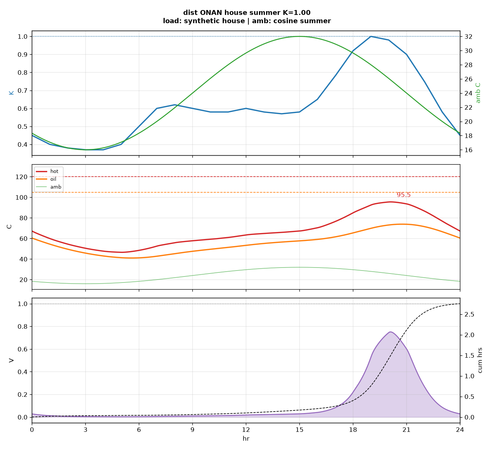

# hotspot

IEC 60076-7 hot-spot hesabi. Bir gunluk yuk ve hava sicakligi alir, yag ve sargi sicakligini adimlar, o gunun kagida kac saat yaslandirdigini yazar.

Konut fiderinde yaz gunu, pik K ne kadar cikarsa kagit tasarimdan hizli yaslanir? `--max-k` bunu pik carpaninda ikiye bolerek arar.

## Ornek

```bash
python main.py
```

```
transformer    : dist ONAN
paper          : normal
profile        : house, peak K = 1.00
season         : summer (16-32 C)
load src       : synthetic house
amb src        : cosine summer
max oil        :  73.9 C
max hot        :  95.5 C at 20:06
day loss       :   2.75 hrs
eq aging       :   0.11 x
life           : 179.1 yr   (ref ~20.5)
```

K = 1, gunun en yuksek yukunun anma yuk oldugu demek. Konut egrisinde bu pik birkac aksam saati. 0.11x, o gunun bir tasarim gununun yaklasik %11'i kadar yaslandirdigi demek. 179 yil, her gun bu sekilde gecerse referans olcegin ne kadar uzayacagi. Tankin 179 yil dayanacagi anlamina gelmez. Referans 180000 saat, yani yaklasik 20.5 yil (IEEE C57.91).



Ust: yuk K ve dis sicaklik. Orta: hot-spot, ust yag, ortam, IEC cevrim sinirlari. Alt: bagil yaslanma V ve gun icinde tuketilen saat. Kaybin cogu aksam pikinde.

## Komutlar

```bash
python main.py --xfmr dist_onan --profile house --peak 1.3 --season summer
python main.py --real --max-k
python main.py --real --profile tr --max-k
python main.py --paper upgraded --sweep
python tests.py
```

numpy ve matplotlib yeter.

| flag | |
|---|---|
| `--xfmr` | `dist_onan`, `pwr_onan`, `pwr_onaf` |
| `--profile` | `house`, `factory`, `shop`, `flat`, `tr` |
| `--peak` | pik yuk carpani |
| `--season` | `winter`, `spring`, `summer`, `fall` |
| `--paper` | `normal` veya `upgraded` |
| `--max-k` | esdeger yaslanma <= 1 olan en buyuk K |
| `--sweep` | K = 0.6 ... 1.5 tablosu |
| `--real` | Ankara havasi |
| `--profile tr` | EPIAS ulusal tuketim CSV |
| `--out` | grafik klasoru |

## Veri

`data/epias_tuketim_2025-07-28.csv` 28 Temmuz 2025 EPIAS gercek zamanli tuketim. Tum Turkiye sistemi, bir sokak trafosu degil. Gece, gunun pikinin yaklasik %64'unde kaliyor. Konut fideri geceleri daha cok duser. Bu yuzden `--real --profile tr --max-k` K = 1 civarina, `--real --max-k` (konut sekli + Ankara havasi) biraz daha yukariya cikar.

Ankara saatlik sicaklik Open-Meteo cevap verirse oradan gelir. Gelmezse yaklasik yaz gunu kullanilir, cikti ve grafik basligi bunu yazar.

## Model

Ust yag ve hot-spot IEC 60076-7 fark denklemleri. Yag yavas, sargi hizli, hot-spot asma yapabilir. Normal kagit 6 K'de bir ikiye katlanir, V = 1 noktasi 98 C. Yukseltilmis kagit Arrhenius, V = 1 noktasi 110 C.

`--max-k` K'yi 0.5 ile 2.0 arasinda boler. 0.5 zaten sicaksa veya 2.0 hâlâ sakinse kok buldum demez, uyari basar.
